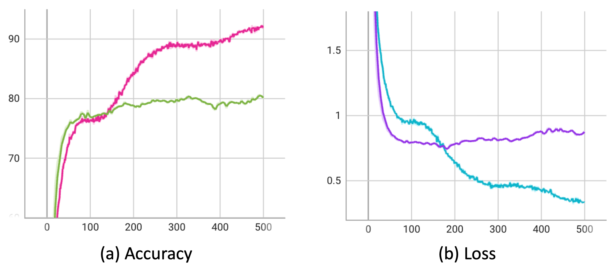
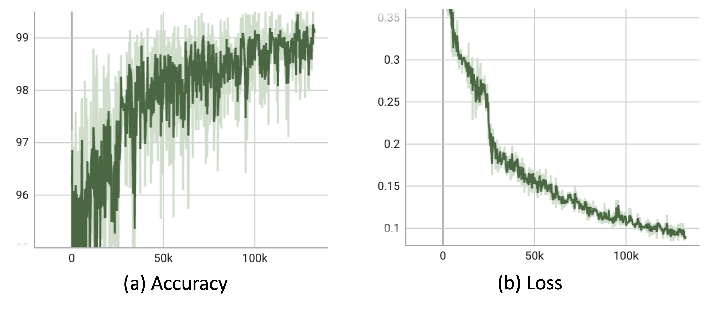
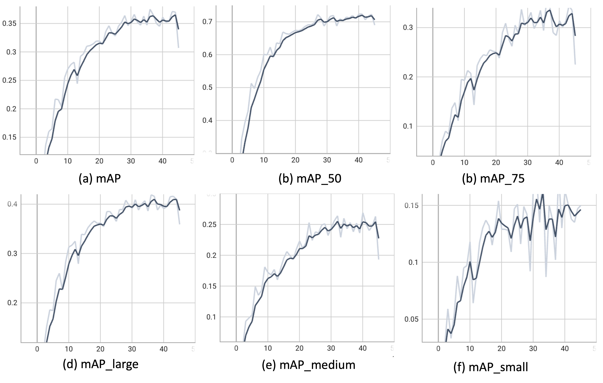
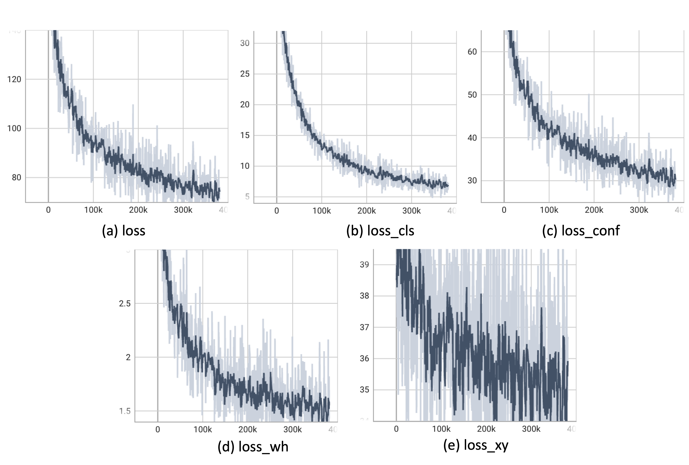

# Midterm
 The repo of midterm project for DATA620004: Neural Network and Deep Learning

## CNN on CUB dataset

* Download dataset: https://data.caltech.edu/records/65de6-vp158, and then unzip into `./CUB_200_2011/`. 

* Download weight: https://drive.google.com/drive/folders/1_8M-21TTVpdxizYT43qhybMJST82XOwE?usp=drive_link, put into `'./logs/0530_lr_0.0003_decay_0.0003_pretrained_True_dropout_True_cutoutFalse_modelResNet34'`

### Train

`python ./Bird/main.py`

| Learning rate | Pretrain | Cutout | Dropout | Model   | Test Accuracy $\uparrow$ |
|---------------|----------|--------|---------|---------|---------------------------|
| $3e-4$        | ✔️       | ❌     | ✔️      | ResNet34 | **83.12%**                |
| $3e-4$        | ✔️       | ✔️     | ✔️      | ResNet34 | 82.27%                    |
| $3e-4$        | ✔️       | ✔️     | ❌      | ResNet34 | 81.72%                    |
| $3e-5$        | ✔️       | ✔️     | ✔️      | ResNet34 | 78.20%                    |
| $3e-4$        | ✔️       | ✔️     | ✔️      | ResNet18 | 77.14%                    |
| $3e-4$        | ❌       | ✔️     | ✔️      | ResNet34 | 43.17%                    |

**Table:** The results on VOC0712 with different hyper-parameters combination. The method with pretrain, cutout augmentation, and Dropout achieved the best performance $83.12\%$.

### Inference

`python ./Bird/infernce.py`

## Object detection on VOC

* Ensure the enviroment is complete for mmdetection.

* Download dataset: http://host.robots.ox.ac.uk/pascal/VOC/, and then unzip into `./data/`. Notably, while training YOLOv3, the format should transfrom to COCO format. 

* Download weight: https://drive.google.com/drive/folders/1_8M-21TTVpdxizYT43qhybMJST82XOwE?usp=drive_link, put into `'./checkpoints/'`
  
### Faster R-CNN

`./object_detection/Faster_RCNN.ipynb`

#### Train

#### Inference

### YOLO-v3

`./object_detection/YOLO_V3.ipynb`

#### Train

#### Inference

